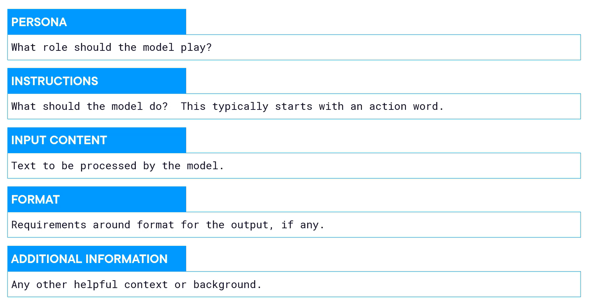
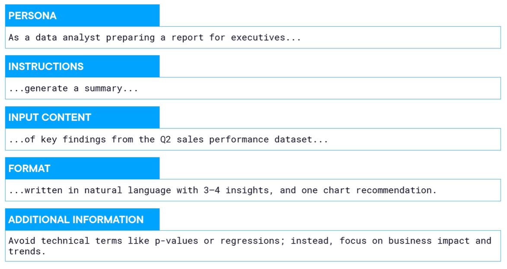
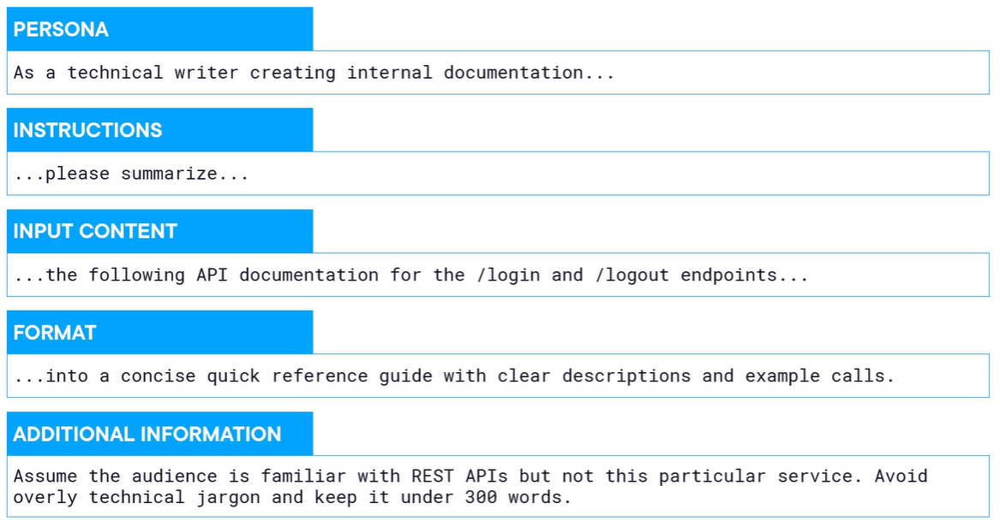
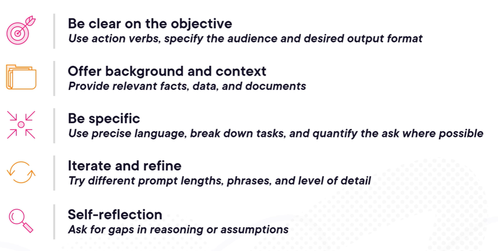
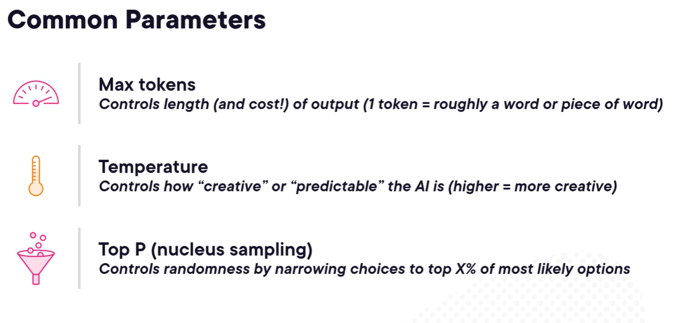

## Anatomy of a prompt

### examples:


---
## Types of Prompts

### Zero-shot Prompting
is a prompt with zero examples.

Examples:
- `Suggest five small Ai side projects that a software developer could build in a weekend`
- `Summarize the key features of Amazon S3 for someone new to cloud storage`

### Few-shot Prompting
is when you give the model a few examples of the task you want before asking it to perform a new one. This helps guide the style, format, and reasoning.

Example:
```
Classify the sentiment of the following sentences as Positive, Negative, or Neutral.

Sentence: I love this phone, the battery life is amazing!
Sentiment: Positive

Sentence: The app crashes every time I open it.
Sentiment: Negative

Sentence: The update was released yesterday.
Sentiment: Neutral

Sentence: The customer service was very helpful and solved my issue quickly.
Sentiment: ?
```

### Chain-of-thought (CoT)
CoT prompts show the model how to reason step-by-step before giving the final answer.

Examples: 
```
Solve the problem step by step. First explain the approach, then write the code.
Given an array of numbers, return the first duplicate number.
```

```
You are a JavaScript developer.
Analyze the bug step by step, explain the issue, then provide the fix.

Problem:
function sum(arr) {
  return arr.reduce((a, b) => a + b);
}

console.log(sum([]));
```

---
## To get better responses


---
## Evaluation Criteria for AI Responses
### Accuracy
How correct the model’s output is.

- Does it give the right answer?
- Does the code compile and pass tests?
- Are the facts correct?

Example: If asked “What is 2+2?” → it should say 4.

### Coherence
How logical and well-structured the response is.

- Does the answer make sense?
- Is it consistent from start to finish?
- Does it contradict itself?

Example: A coherent explanation follows a clear reasoning flow and doesn’t switch topics randomly.

### Bias
Whether the model unfairly favors or discriminates against certain groups, ideas, or perspectives.

- Does it produce stereotypical or unfair responses?
- Does it treat different groups neutrally and respectfully?

Example: A fair model should not generate harmful stereotypes when describing professions, genders, or nationalities.
#### In short:
- **Accuracy** → Is it correct?
- **Coherence** → Does it make sense?
- **Bias** → Is it fair and neutral?

---

## Model Parameters


### Temperature
Controls randomness.

- **Low temperature (0–0.3)** → More deterministic, focused, predictable
- **Medium (0.5–0.7)** → Balanced
- **High (0.8–1.2)** → More creative, diverse, sometimes less accurate

Example:  
For coding → use low temperature (0–0.3)  
For storytelling → use higher temperature

### Top-P (Nucleus Sampling)
Controls how many probable words the model can choose from.

- The model selects from the smallest group of words whose total probability ≥ top_p.
- **Lower top_p (e.g., 0.5)** → safer, more focused
- **Higher top_p (e.g., 0.9–1)** → more diverse

Think of it as limiting the “choice pool” of next words.
Usually you adjust **either temperature or top_p**, not both aggressively.

### Max Tokens
Limits how long the response can be.

- Prevents very long outputs
- Controls cost (important in production)
- If too small → response may get cut off

Example:
- Short answer → 100 tokens
- Long explanation → 500+ tokens

### Stop Sequence
Tells the model when to stop generating.
You provide a specific string, and generation stops when it appears.

Example:  
If stop sequence = `"###"`  
The model will stop when it generates `###`.

useful for:
- Structured outputs
- Chat simulations
- Preventing extra unwanted text

### in short:
- **Temperature** → randomness level
- **Top-P** → probability filtering
- **Max tokens** → output length limit
- **Stop sequence** → custom stopping rule
