# Prompt Engineering Best Practices

## General Advices:

### be more specific
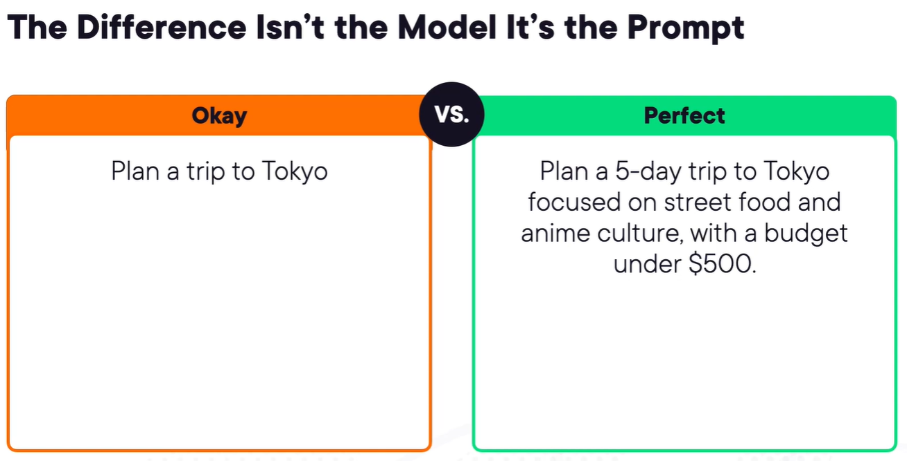

### Don't fall into these traps:
#### 1. Vagueness

**Definition:**  
A prompt that is too general or unclear.

**Example (Bad):**
Explain AI.

**Problem:**  
No audience, depth, format, or constraints specified.
**Better:**
Explain Artificial Intelligence for beginner developers in under 200 words with one example.
**Fix:**  
Specify audience, length, format, and constraints.

#### 2. Bias

**Definition:**  
A prompt that pushes the model toward a specific assumption or opinion.

**Example (Biased):**
Why is Angular better than React?

**Problem:**  
Assumes Angular is better.
**Better:**
Compare Angular and React in terms of performance, learning curve, and scalability.
**Fix:**  
Ask neutral and balanced questions.

#### 3. Overload

**Definition:**  
Asking for too many tasks in one prompt.

**Example (Overloaded):**
Explain microservices, compare to monoliths, give Node.js code, discuss scaling and security, and summarize in a table.

**Problem:**  
Shallow, messy, or incomplete output.
**Better:**  
Break the request into smaller prompts.
**Fix:**  
Split complex tasks into multiple steps.


### Provide Context

Copy the context into the model this helps with lack of data and helps the model generate better answers.

---

## How Models Work?!

### LLMs

Large Language Models (LLMs) are trained on massive amounts of text data.  
Instead of reading full words, they split text into smaller units called **tokens**.  
A token can be a whole word, part of a word, or even punctuation.

The model processes input and output as sequences of tokens.

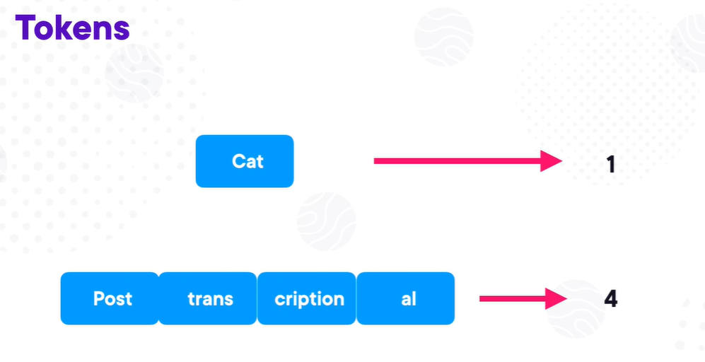

When generating a response, the model predicts the **next most probable token** based on the previous tokens and its training.  
It calculates probabilities for possible next tokens and selects the most likely one (depending on the sampling method).  

This process repeats step by step, which is why responses appear to be generated word by word (more accurately, token by token).

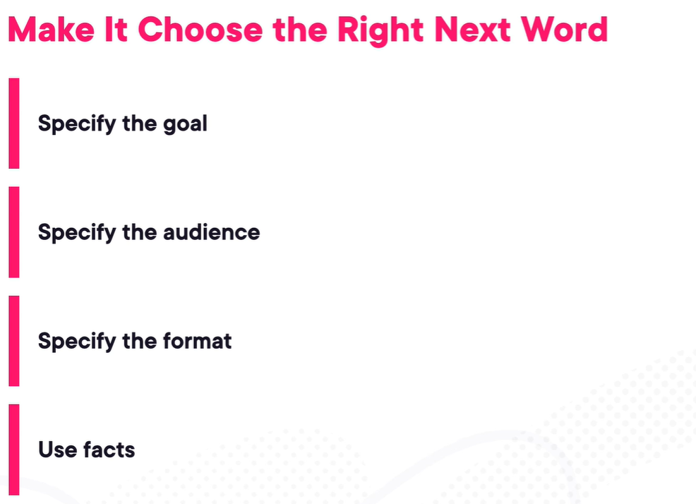

---

## Context

LLMs do not truly "remember" past conversations.  
Each request includes the previous messages inside a **context window**, and the model processes the entire conversation again to generate a response.

This creates the illusion of memory, but in reality:
- The full conversation is resent each time.
- More context means more tokens.
- More tokens increase cost and processing time.

Because of this, some companies recommend starting a new chat when:
- The topic changes completely.
- The conversation becomes too long.
- Irrelevant history is affecting responses.

### Why Chunking Is Important

**Chunking** means breaking large content into smaller, manageable pieces before sending it to the model.

Benefits:
- Reduces token usage
- Improves accuracy
- Prevents context overflow
- Makes responses more focused

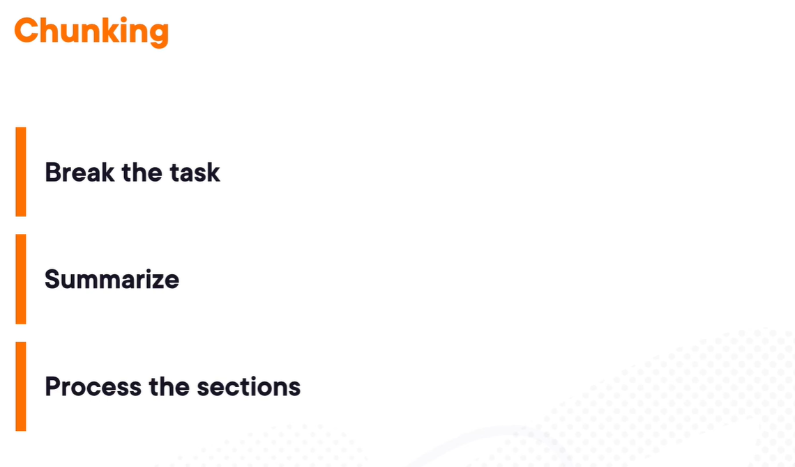

### Chunking Example

Instead of sending a 50-page document at once:
1. Split it into logical sections.
2. Process each section separately.
3. Combine or summarize the outputs.

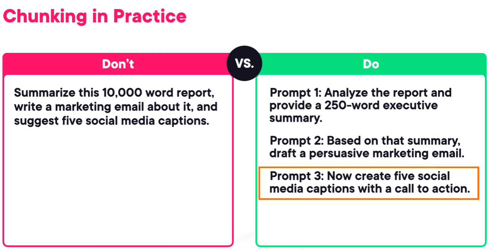

### Context Best Practices

- Keep prompts focused and relevant.
- Remove unnecessary previous messages.
- Start a new chat when context becomes noisy.
- Use summaries instead of full history when possible.

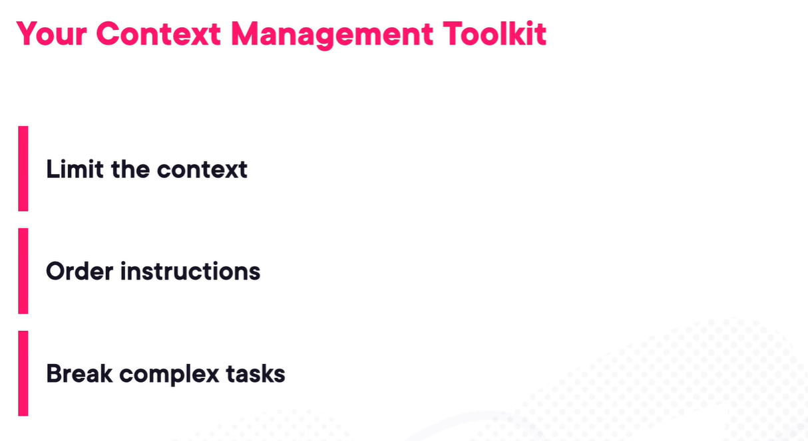

---

## Efficiency

### LLMs Footprint:
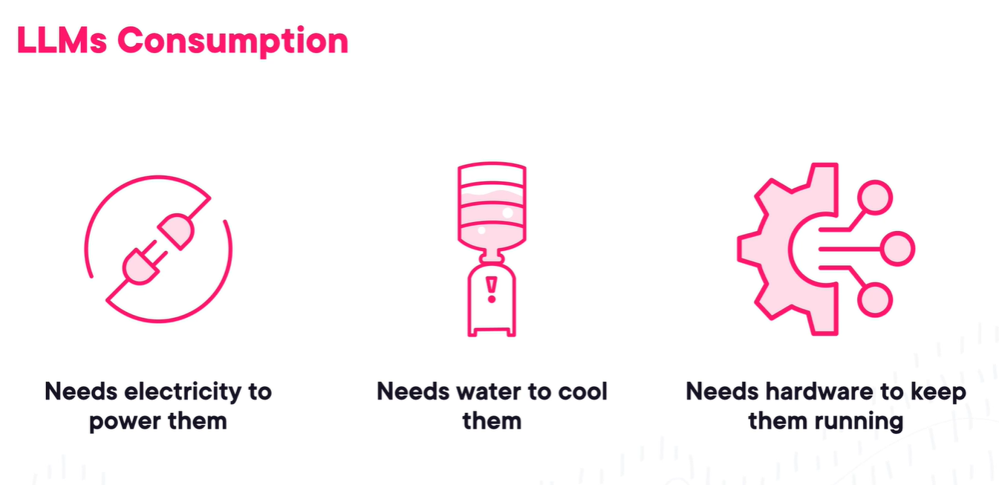
### Efficiency Advices:
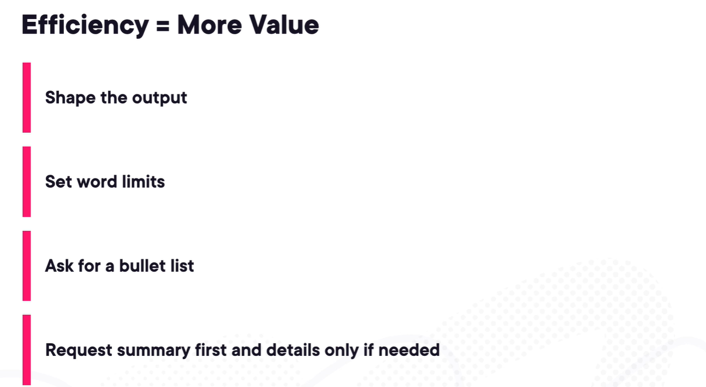

## Prompt Engineering Strategies

### 1. Act As (Role Prompting)

Tell the model to behave as a specific role to guide tone, depth, and perspective.

**Example:**
Act as a senior backend engineer and explain REST API design best practices.

**Why it works:**
- Sets expertise level
- Controls explanation depth
- Improves structure and relevance

### 2. Reusable Prompt Format

Create a structured template you can reuse across tasks.

**Example Template:**
- Role:
- Task:
- Audience:
- Constraints:
- Output format:

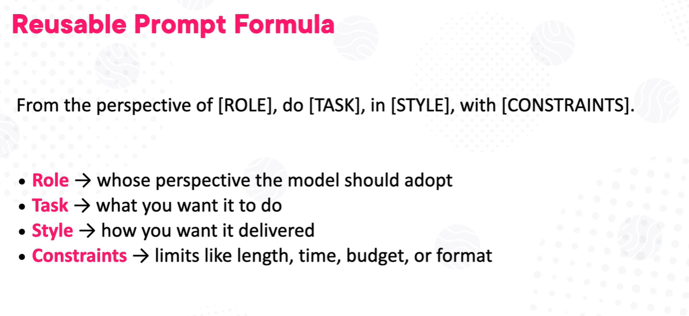

**Why it works:**
- Ensures consistency
- Reduces vagueness
- Saves time
- Produces predictable results

### 3. Iterative Refinement

Improve output step by step instead of expecting perfection in one prompt.

**Process:**
1. Generate initial answer.
2. Ask for improvements (clarify, shorten, add examples, restructure).
3. Refine until it meets expectations.

**Why it works:**
- Higher quality output
- Better alignment with intent
- Reduces overload

### 4. History Management (When to Continue vs Start New Chat)

LLMs process the entire conversation each time.

**Continue the same chat when:**
- The topic is the same.
- Previous context is relevant.
- You are refining the same task.

**Start a new chat when:**
- The topic changes completely.
- The conversation becomes too long.
- Old context is confusing the model.
- You want a fresh perspective.

Proper history management reduces cost and improves clarity.

### 5. Prompt Chaining

You can Ask a Model to generate a prompt to feed another model

**Example:**
- Ask ChatGPT to write a prompt to generate an images using Gemini

### 6. Avoiding Hallucination

Hallucination happens when the model generates incorrect or fabricated information.

**How to reduce it:**
- Ask for sources when factual accuracy matters.
- Constrain the task ("If unsure, say you don’t know").
- Provide context instead of relying on assumptions.
- Ask the model to explain its reasoning.
- Verify important outputs manually.

Clear constraints and focused prompts reduce hallucination risk.

## Debugging the Prompt: Refinement and Context Issues

When output is weak or incorrect, the problem is often:
1. The prompt needs refinement.
2. The context is too long, noisy, or irrelevant.

### 1. Iterative Refinement

Do not expect perfect output in one attempt.  
Treat prompting as an iterative process.

#### Step 1: Generate a Draft
Start with a clear but simple prompt.

Example:
Explain event loop in Node.js.

#### Step 2: Diagnose the Issue
Ask:
- Too shallow?
- Too long?
- Too technical?
- Missing examples?
- Poor structure?

#### Step 3: Refine Precisely

Instead of rewriting everything, improve it step by step:

- Make it suitable for junior developers.
- Add a simple code example.
- Explain in under 200 words.
- Use bullet points.
- Remove unnecessary theory.

Each refinement makes the output closer to your goal.

#### Key Idea

Refinement works best when:
- You change one variable at a time.
- You give specific correction instructions.
- You avoid adding too many new requirements at once.

Prompting is closer to editing than commanding.

### 2. Context Issues

LLMs process the entire conversation every time.  
If the context becomes large or noisy, quality may drop.

#### Common Context Problems

- Too many unrelated topics in one chat
- Old instructions conflicting with new ones
- Long conversation history increasing token usage
- Model focusing on irrelevant earlier details

This can cause:
- Confused answers
- Repetition
- Ignored instructions
- Higher cost

#### When to Continue the Same Chat

- You are refining the same task.
- Previous context is directly relevant.
- You are building on earlier output.
#### When to Start a New Chat

- Topic changes completely.
- The conversation is very long.
- The model starts behaving inconsistently.
- You want a clean reset without past influence.

#### Best Practice

If context becomes messy:
1. Start a new chat.
2. Provide a clean, structured summary of what matters.
3. Clearly restate your goal.

Clean context + iterative refinement = higher quality results.

---

## Chain of Thought (CoT) vs ReAct

Both are prompting strategies that improve reasoning, but they work differently.

### 1. Chain of Thought (CoT)

#### What It Is
A prompting technique that encourages the model to reason step by step before giving the final answer.

#### Goal
Improve logical reasoning and accuracy.

#### Example (Math)

Prompt:
Solve this step by step:  
If a train travels 60 km/h for 3 hours, how far does it travel?

Model reasoning:
1. Speed = 60 km/h  
2. Time = 3 hours  
3. Distance = speed × time  
4. 60 × 3 = 180  

Final Answer: 180 km

#### When to Use
- Math problems
- Logic puzzles
- Algorithm explanations
- Multi-step reasoning tasks

#### Limitation
- Reasoning is internal to the model.
- No interaction with external tools.
- Can still hallucinate facts.

### 2. ReAct (Reason + Act)

#### What It Is
A framework where the model alternates between:
- Reasoning
- Taking actions (like searching or calling tools)
- Observing results
- Continuing reasoning
#### Structure
Thought → Action → Observation → Thought → Final Answer

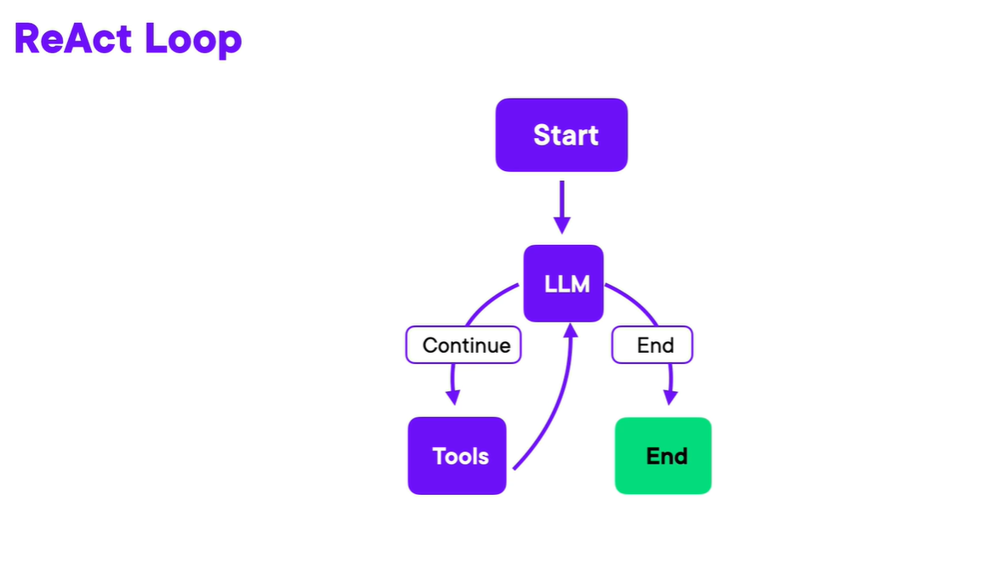

#### Example (Fact Question)

Question:
Who is the current president of France?

ReAct flow:
Thought: I need up-to-date information.  
Action: Search  
Observation: Search result shows current president.  
Thought: I now have the answer.  
Final Answer: ~~

#### When to Use
- Tasks requiring external data
- Web search
- Tool usage
- APIs or database queries
- Real-world decision systems

#### Advantage
- More reliable for factual questions.
- Can verify information using tools.

### Key Differences

| Feature                | Chain of Thought  | ReAct            |
| ---------------------- | ----------------- | ---------------- |
| Step-by-step reasoning | Yes               | Yes              |
| Uses external tools    | No                | Yes              |
| Best for               | Logical reasoning | Tool-based tasks |
| Reduces hallucination  | Sometimes         | More effectively |

### Simple Summary

Chain of Thought = Think step by step.  
ReAct = Think, act, observe, repeat.

---

## Maximize Efficiency

To get professional results from LLMs, treat your prompt as a complete instruction set — not a casual question.

The clearer and more structured your instructions, the better the output.

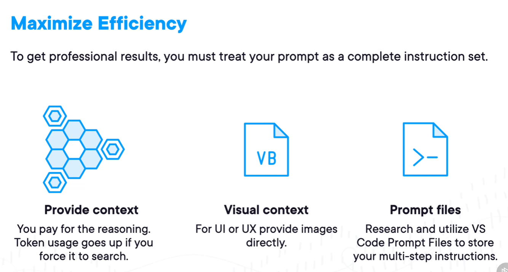
### Provide Context

LLMs do not guess your situation. They only work with what you provide.

If you don’t give context:
- The model makes assumptions.
- The response becomes generic.
- Token usage increases due to unnecessary reasoning.

Instead of:
Build me an API.

Use:
Build a REST API in Node.js using Express for a task management app. Include CRUD routes and basic validation.

Clear context:
- Reduces ambiguity
- Improves relevance
- Makes responses more efficient

### Visual Context

For UI, UX, or design-related tasks, provide images directly.

Attach:
- Screenshots
- Wireframes
- Mockups
- Diagrams

Visual input:
- Reduces misinterpretation
- Speeds up understanding
- Improves layout and styling suggestions

### Prompt Files

For complex or repeated workflows, store structured prompts in reusable files.

Use cases:
- Code review standards
- Documentation rules
- Testing instructions
- Multi-step generation workflows

Benefits:
- Consistent output
- Reusable structure
- Less repetition
- Better team efficiency

---

## Prompt Guardrails

**Prompt guardrails** are techniques or constraints applied to AI prompts to ensure responses are **safe, relevant, and aligned** with user intentions. They act like rails, keeping AI outputs on track.

### Key Points
- **Purpose:** Prevent harmful, biased, or irrelevant outputs.  
- **Types:**
  - Instruction constraints (what AI should/shouldn’t do)  
  - Content/style limits (tone, length, format)  
  - Role/persona assignment (e.g., expert, teacher)  
  - Safety filters (avoid violent, hateful, or unsafe content)  
  - Verification/fact-checking (step-by-step reasoning)  
  - Contextual restrictions (use only given sources)  
- **Benefits:** More accurate, consistent, and trustworthy AI responses.

**Example:**  
```
Act as a professional tutor. Explain this concept in simple terms without giving medical advice.
```

---

## Ethics in Prompt Engineering

**Ethics in prompt engineering** ensures AI prompts produce **safe, fair, and responsible** outputs. It focuses on guiding AI while minimizing harm, bias, and misinformation.

### Key Points
- **Bias & Fairness:** Avoid reinforcing stereotypes or discrimination.  
- **Transparency:** Clearly indicate AI-generated content vs. facts.  
- **Safety:** Prevent prompts that encourage illegal, violent, or unsafe content.  
- **Privacy:** Protect sensitive data and respect confidentiality.  
- **Responsibility:** Prompt designers are accountable for AI outputs and societal impact.

**Best Practice Example:**  
```
"Provide a professional explanation suitable for all audiences. Avoid offensive or biased language."
```